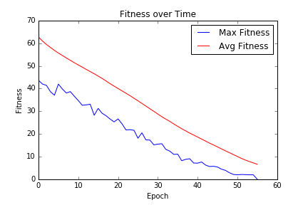

# Sudoku Genetic Algorithm Solver  
This program was written as a class project to attempt to solve Sudoku Puzzles with Genetic Algorithms. It is successful at solving the puzzles however it is not very optimized. 

## Installing  
This application was written in Python 3 using the Anaconda Suite.  
To install Anaconda visit: https://www.continuum.io/downloads  

## Running the Program
The program looks for an in.txt when it starts. The file should contain a width and height followed by a grid on a single line

```
9 9
X,X,7,6,5,1,9,X,2,2,X,X,9,X,X,X,8,X,X,4,5,X,2,3,7,X,X,X,X,X,X,X,X,X,X,8,1,7,X,4,X,8,X,9,6,3,X,X,X,X,X,X,X,X,X,X,3,2,7,X,8,1,X,X,2,X,X,X,4,X,X,3,4,X,1,3,8,5,2,X,X
```

The program will run and display output into a Runs Folder. You can see a sample runs folder [here](Runs).  
Three files will be created.
 - log.txt - A file that displays the current grid based. The frequency of logging will update with the settings.
 - out.txt - The correct grid produced at the end. 
 - graph.png - The graph of the fitness over time.

### Example Log.txt  
At the top 5 parameters are shown:
 - **Generation** is the current iteration it is running.   
 - **Fitness** is the best fitness  how many rule violations are present. A random number < 1 was added to fitness to randomize identical fitness scores. 
 - **Avg Fitness** is the average fitness of all the genes.
 - **Current Mutation** is the current Mutation Rate as a percentage. (.20 = 20%) 
 - **Generations at current best** is how many generations it has been stuck at the current fitness. 

Next a text grid is displayed that shows the errors:  
 - "(x)" - Means a line error
 - "[x]" - Means a column error
 - "{x}" - Means a box error

```
Generation 55
Fitness-3.89
Avg Fitness=15.32
Current Mutation=0.20
Generations at current best=1.00

[ 3 {1} 9 ][ 5  4  6 ][ 8  7  2 ]
[{7} 2  4 ][ 3  9  8 ][ 5  6  1 ]
[ 6  8  5 ][ 2  1  7 ][ 4  3  9 ]

[ 8  5 {6}][ 1  3  9 ][ 7  2  4 ]
[{7} 9  2 ][ 4  6  5 ][ 1  8  3 ]
[ 4 {1} 3 ][ 8  7  2 ][ 6  9  5 ]

[ 2  4  1 ][ 7  8  3 ][ 9  5  6 ]
[ 5  7 {6}][ 9  2  4 ][ 3  1  8 ]
[ 9  3  8 ][ 6  5  1 ][ 2  4  7 ]
```

### Out.txt
The output file shows the settings that were used to run the genetic algorithm.  
 - **population_size** is the number of genes.  
 - **mutation_precentage** is the base mutation percentage.  
 - **mutation_generations_increase** is the number of generations at the same fitness until the.   mutation_generations_increase_percentage is added to the mutation_precentage.  
 - **mutation_generations_increase_percentage** is the percentage that it will increase every mutation_generations_increase, if the fitness stays constant.
 - **tournament_size** is the number of genes selected in each tournament.  
 - **elitism** is the number of genes that are always kept.  

The results are shown below with the:
 - Number of generations 
 - Starting grid 
 - Best fitness in an array 
 - Average fitness in an array
 - Correct sudoku grid

```
------------Settings-------------
population_size = 30000
mutation_precentage = 0.2
mutation_generations_increase = 5.00
mutation_generations_increase_percentage = 0.05
tournament_size = 3
elitism = 0

------------Results-------------
Generations:57
['X', 'X', '9', '5', 'X', 'X', '8', 'X', 'X', 'X', 'X', '4', 'X', 'X', 'X', 'X', '6', '1', '6', 'X', '5', 'X', 'X', '7', 'X', 'X', 'X', '8', 'X', 'X', '1', '3', 'X', 'X', '2', '4', 'X', '9', 'X', 'X', '6', 'X', 'X', 'X', 'X', 'X', 'X', 'X', 'X', '7', '2', 'X', '9', 'X', '2', 'X', '1', '7', 'X', 'X', 'X', 'X', 'X', 'X', 'X', 'X', '9', 'X', 'X', '3', 'X', '8', 'X', '3', 'X', 'X', '5', 'X', 'X', '4', 'X']
[3, 1, 9, 5, 4, 6, 8, 7, 2, 7, 2, 4, 3, 9, 8, 5, 6, 1, 6, 8, 5, 2, 1, 7, 4, 3, 9, 8, 5, 7, 1, 3, 9, 6, 2, 4, 1, 9, 2, 4, 6, 5, 7, 8, 3, 4, 6, 3, 8, 7, 2, 1, 9, 5, 2, 4, 1, 7, 8, 3, 9, 5, 6, 5, 7, 6, 9, 2, 4, 3, 1, 8, 9, 3, 8, 6, 5, 1, 2, 4, 7]
[49.883681711837866, ...]

[ 3  1  9 ][ 5  4  6 ][ 8  7  2 ]
[ 7  2  4 ][ 3  9  8 ][ 5  6  1 ]
[ 6  8  5 ][ 2  1  7 ][ 4  3  9 ]

[ 8  5  7 ][ 1  3  9 ][ 6  2  4 ]
[ 1  9  2 ][ 4  6  5 ][ 7  8  3 ]
[ 4  6  3 ][ 8  7  2 ][ 1  9  5 ]

[ 2  4  1 ][ 7  8  3 ][ 9  5  6 ]
[ 5  7  6 ][ 9  2  4 ][ 3  1  8 ]
[ 9  3  8 ][ 6  5  1 ][ 2  4  7 ]
```

### graph.png


## Contributing

Please read [CONTRIBUTING.md](CONTRIBUTING.md) for details on our code of conduct, and the process for submitting pull requests to us.

## Versioning

For the versions available, see the [tags on this repository](https://github.com/tylerburnham42/PythonSudokuGASolver/tags). 

## Authors

* **Tyler Burnham** - *Initial work* - [tylerburnham42](https://github.com/tylerburnham42)

See also the list of [contributors](https://github.com/tylerburnham42/PythonSudokuGASolver/contributors) who participated in this project.

## License

This project is licensed under the MIT License - see the [LICENSE.md](LICENSE.md) file for details
